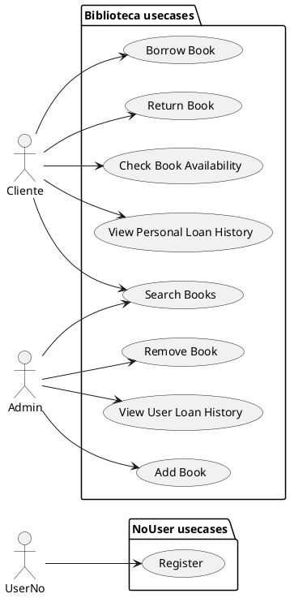
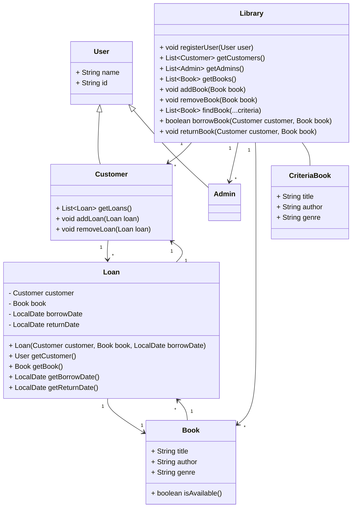

# Simulacro Examen 3ª Evaluación Entornos de Desarrollo (Solución)

> 💡 Notas<br>
>  - No existen una solución única para los ejercicios planteados. A continuación se muestra una posible solución a los ejercicios propuestos.
>  - En el diagrama de clases, para que sea más legible, se han omitido los métodos `get` y `set` de las clases, así como otros atributos y métodos que no son relevantes para la solución propuesta.
>  - Se ha utilizado métodos Lambda (Streams) para simplificar la implementación de los ejercicios. (Java)
>  - Para filtrar por distintos criterios, se ha aplicado el patrón `Criteria`, y su implementación en una clase `CriteriaBook`.
>  - Puede que haya erratas, la idea es que se entienda la solución propuesta.

### Sistema de Biblioteca Digital

Se necesita desarrollar un sistema de software para gestionar una biblioteca digital. El sistema debe permitir a los usuarios realizar las siguientes acciones:

- Registrarse en el sistema.
- Buscar libros por título, autor o género.
- Pedir prestado un libro.
- Devolver un libro.
- Consultar la disponibilidad de un libro.
- Ver el historial de préstamos.

Además, los administradores del sistema deben poder:

- Añadir nuevos libros a la colección.
- Eliminar libros de la colección.
- Ver el historial de préstamos de cualquier usuario.


### Ejercicio 1: Diagrama de casos de uso

**Define los casos de uso del sistema**

1. Identifica los actores principales del sistema, indicando nombre y un pequeña descripción de su función dentro del sistema.

    **Actores**

   - UsuarioNoRegistrado: Persona que accede al sistema sin estar registrado.
   - Cliente: Persona registrada en el sistema, y que puede utilizar los servicios de la biblioteca digital.
   - Administrador: Persona encargada de gestionar la colección de libros y los préstamos.

---

2. Identifica los casos de uso, indicando nombre y un pequeño resumen de la funcionalidad.

    **Casos de Uso**

    - Registro de Usuario: Agregar un usuario a la biblioteca.
    - Búsqueda de Libros: Consulta de los libros incluidos en la biblioteca.
    - Préstamo de Libro: Un libro es retirado de la biblioteca y no está disponible para otros clientes.
    - Devolución de Libro: Un libro es devuelto a la biblioteca y está disponible para otros clientes.
    - Consulta de Disponibilidad de Libro: Consulta si un libro está disponible para su préstamo.
    - Consulta de Historial de Préstamos: Un cliente consulta el historial de préstamos realizados.
    - Añadir Libro: Un libro es añadido a la colección de libros de la biblioteca.
    - Eliminar Libro: Un libro es eliminado de los libros disponibles de la biblioteca.
    - Consulta de Historial de Préstamos: Un administrador consulta los préstamos realizados por un cliente.

---

3. Crea un diagrama de casos de uso utilizando PlantUML, utilizando para ello un bloque de código en markdown.


---


### Ejercicio 2: Diagrama de clases

Basado en los casos de uso definidos, elabora un diagrama de clases, incorporando cardinalidad y relaciones con direccionalidad.




### Ejercicio 3: Generar clases a código

En base al diagrama de clases anterior, genera las clases en Java incluidas en el mismo, incluyendo atributos y métodos, así como las relaciones entre las clases.

Genera un proyecto en IntelliJ IDEA, con el nombre `BibliotecaDigitalEEDD`, y crea las clases en el paquete raíz `com.iessdf.eedd.digitalbooks`, y las clases dentro del paquete `model`. 

Para ello, crea un proyecto basado en Maven desde la opción File -> New -> Project... -> Maven -> Create from archetype -> maven-archetype-quickstart, y pon el nombre del proyecto BibliotecaDigitalEEDD.

 > 💡Nota: Recuerda crear un fichero .gitignore para ignorar los ficheros de configuración de IntelliJ IDEA.

```java
import java.time.LocalDate;
import java.util.List;
import java.util.ArrayList;


public class User {
    private String name;
    private String id;

    public User(String name, String id) {
        this.name = name;
        this.id = id;
    }

    public String getName() {
        return name;
    }

    public String getId() {
        return id;
    }
}


public class Admin extends User {
    public Admin(String name, String id) {
        super(name, id);
    }
}

public class Customer extends User {
    private List<Loan> loans;

    public Customer(String name, String id) {
        super(name, id);
        this.loans = new ArrayList<>();
    }

    public List<Loan> getLoans() {
        return loans;
    }

    public void addLoan(Loan loan) {
        loans.add(loan);
    }

    public void removeLoan(Loan loan) {
        loans.remove(loan);
    }
}

public class Book {
    private String title;
    private String author;
    private String genre;
    private boolean available;

    public Book(String title, String author, String genre) {
        this.title = title;
        this.author = author;
        this.genre = genre;
        this.available = true;
    }

    public String getTitle() {
        return title;
    }

    public String getAuthor() {
        return author;
    }

    public String getGenre() {
        return genre;
    }

    public boolean isAvailable() {
        return available;
    }

    public void setAvailable(boolean available) {
        this.available = available;
    }
}

public class Loan {
    private Customer customer;
    private Book book;
    private LocalDate borrowDate;
    private LocalDate returnDate;

    public Loan(Customer customer, Book book, LocalDate borrowDate) {
        this.customer = customer;
        this.book = book;
        this.borrowDate = borrowDate;
    }

    public Customer getCustomer() {
        return customer;
    }

    public Book getBook() {
        return book;
    }

    public LocalDate getBorrowDate() {
        return borrowDate;
    }

    public LocalDate getReturnDate() {
        return returnDate;
    }

    public void setReturnDate(LocalDate returnDate) {
        this.returnDate = returnDate;
    }
}

public class CriteriaBook {
    private String title;
    private String author;
    private String genre;

    public String getTitle() {
        return title;
    }

    public String getAuthor() {
        return author;
    }

    public String getGenre() {
        return genre;
    }

    public void setTitle(String title) {
        this.title = title;
    }

    public void setAuthor(String author) {
        this.author = author;
    }

    public void setGenre(String genre) {
        this.genre = genre;
    }
}


public class Library {
    private List<Customer> customers;
    private List<Admin> admins;
    private List<Book> books;

    public Library() {
        this.customers = new ArrayList<>();
        this.admins = new ArrayList<>();
        this.books = new ArrayList<>();
    }

    public void registerUser(User user) {
        if (user instanceof Customer) {
            customers.add((Customer) user);
        } else if (user instanceof Admin) {
            admins.add((Admin) user);
        }
    }

    public List<Customer> getCustomers() {
        return customers;
    }

    public List<Admin> getAdmins() {
        return admins;
    }

    public List<Book> getBooks() {
        return books;
    }

    public void addBook(Book book) {
        books.add(book);
    }

    public void removeBook(Book book) {
        books.remove(book);
    }

     public List<Book> findBookBy(CriteriaBook criteriaBook) {

        List<Book> filter = new ArrayList<>();

        if (criteriaBook.getTitle() != null) {
            var result = new ArrayList<>(books.stream().filter(book -> book.getTitle().equals(criteriaBook.getTitle())).toList());
            filter.addAll(result);
        }

        if (criteriaBook.getAuthor() != null) {
            var result = new ArrayList<>(books.stream().filter(book -> book.getAuthor().equals(criteriaBook.getAuthor())).toList());
            filter.addAll(result);
        }

        if (criteriaBook.getGenre() != null) {
            var result = new ArrayList<>(books.stream().filter(book -> book.getGenre().equals(criteriaBook.getGenre())).toList());
            filter.addAll(result);
        }

        return filter;

    }

    public boolean borrowBook(Customer customer, Book book) {
        if (book.isAvailable()) {
            book.setAvailable(false);
            customer.addLoan(new Loan(customer, book, LocalDate.now()));
            return true;
        }
        return false;
    }

    public void returnBook(Customer customer, Book book) {
        book.setAvailable(true);
        for (Loan loan : customer.getLoans()) {
            if (loan.getBook().equals(book)) {
                loan.setReturnDate(LocalDate.now());
                customer.removeLoan(loan);
                break;
            }
        }
    }
}
```


### Ejercicio 4: Generar Test Unitarios

Genera los test siguientes para clase Biblioteca, encargada de la gestión de realizar préstamos y devoluciones de libros.

1. Crea una clase BibliotecaTest en el paquete `com.iessdf.eedd.digitalbooks.model` dentro de la carpeta `test`.
2. Realiza los siguientes test unitarios:
   - should_RegisterUser: Comprueba que se registra un usuario correctamente.
   - should_FindBookByTitle: Comprueba que se encuentra un libro por título.
   - should_SucessfulBorrowBook: Comprueba que se realiza un préstamo de un libro.
   - should_SucessfulReturnBook: Comprueba que se devuelve un libro.


Realiza los siguientes

```java
import org.junit.jupiter.api.AfterEach;
import org.junit.jupiter.api.BeforeEach;
import org.junit.jupiter.api.Test;

import static org.junit.jupiter.api.Assertions.*;

class LibraryTest {

    Library library;

    @BeforeEach
    void setUp() {
        library = new Library();
    }

    @Test
    public void should_RegisterUser() {
        // Arrange
        Customer newuser = new Customer("Juan", "12345678A");
        // Act
        library.registerUser(newuser);
        // Assert
        assertTrue(library.getCustomers().contains(newuser));
    }

    @Test
    public void should_FindbookByTitle() {
        // Arrange
        Book book = new Book("Don Quixote", "Cervantes", "Novel");
        library.addBook(book);
        // Act
        CriteriaBook criteriaBook = new CriteriaBook();
        criteriaBook.setTitle("Don Quixote");
        var result = library.findBookBy(criteriaBook);
        // Assert
        assertTrue(result.contains(book));
    }

    @Test
    public void should_SuccessfullyBorrowBook() {
        // Arrange
        Customer customer = new Customer("Juan", "12345678A");
        Book book = new Book("Don Quixote", "Cervantes", "Novel");
        library.addBook(book);
        // Act
        boolean borrowSuccess = library.borrowBook(customer, book);
        var customerLoans = customer.getLoans();
        // Assert
        assertTrue(borrowSuccess);
        assertFalse(book.isAvailable());
        assertTrue(customerLoans.stream().anyMatch(loan -> loan.getBook().equals(book)));
    }

    @Test
    public void should_SucessfulReturnBook() {
        // Arrange
        Customer customer = new Customer("Juan", "12345678A");
        Book book = new Book("Don Quixote", "Cervantes", "Novel");
        library.addBook(book);
        library.borrowBook(customer, book);
        // Act
        boolean returnSuccess = library.returnBook(customer, book);
        var customerLoans = customer.getLoans();
        // Assert
        assertTrue(returnSuccess);
        assertTrue(book.isAvailable());
        assertEquals(0, customerLoans.size());
    }


    @AfterEach
    void tearDown() {
        library = null;
    }
}

```


### Ejercicio 5: Cobertura de código

Ejecuta la cobertura de código de IntelljIDEA a tu proyecto, y comprueba que los test unitarios cubren al menos un 80% del código de la clase Biblioteca.

---

En este caso, y después de ejecutar la cobertura de código, se comprueba de métodos es del 63%, por lo que aún no llegamos al 80% de cobertura. Por lo tanto, se deben añadir más test unitarios.

| Nombre |  Class | Method | Line | Condition |
|--------|--------|--------|------|-----------|
| Library | 100% | 70% (7/10) | 67% | 43%% |

En base a estos resultados, vamos a agregar algún test unitario más para aumentar la cobertura de código de métodos hasta el 80%.


Si chequeamos la clase `Library`, vemos que los métodos que no están cubiertos son los siguientes:

- `getAdmins()`
- `getBooks()`
- `removeBook(Book book)`


En base a esto se crean el siguiente test, renombramos el test `should_RegisterUser` a `should_RegisterCustomer` y añadimos el test `should_RegisterAdmin`.

```java
    @Test
    public void should_RegisterCustomer() {
        // Arrange
        Customer newuser = new Customer("Juan", "12345678A");
        // Act
        library.registerUser(newuser);
        // Assert
        assertTrue(library.getCustomers().contains(newuser));
    }

    @Test
    public void should_RegisterAdmin() {
        // Arrange
        Admin newuser = new Admin("Admin1", "987654321B");
        // Act
        library.registerUser(newuser);
        // Assert
        assertTrue(library.getAdmins().contains(newuser));
    }

```

Ahora si ejecutamos de nuevo la cobertura de código, vemos que la cobertura de métodos es del 80%, por lo que se ha alcanzado el objetivo de cobertura de código.

| Nombre |  Class | Method | Line | Condition |
|--------|--------|--------|------|-----------|
| Library | 100% | 80% (8/10) | 67% | 43%% |


Por tanto hemos cumplido con el objetivo de cobertura de código del 80% en la clase `Library`.