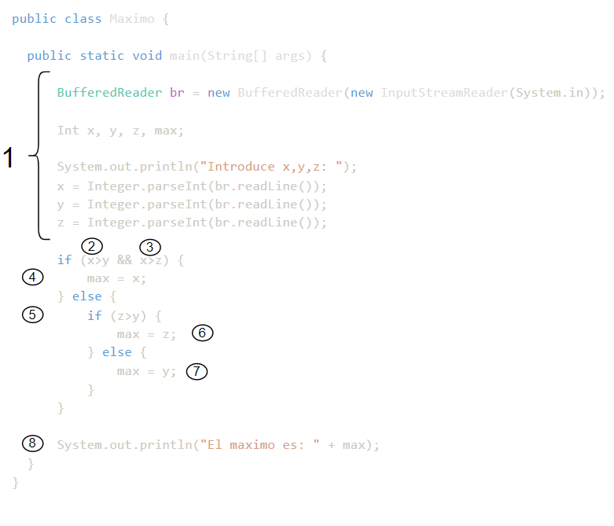
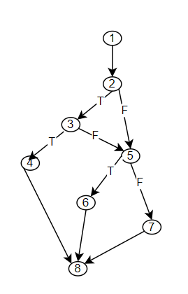
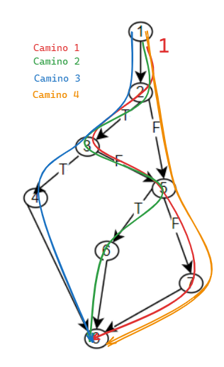
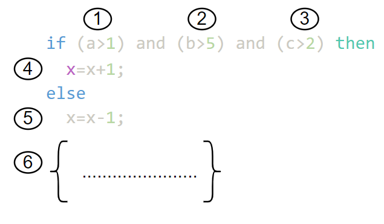
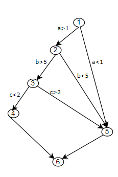
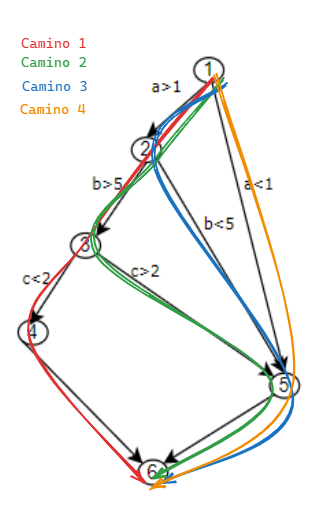
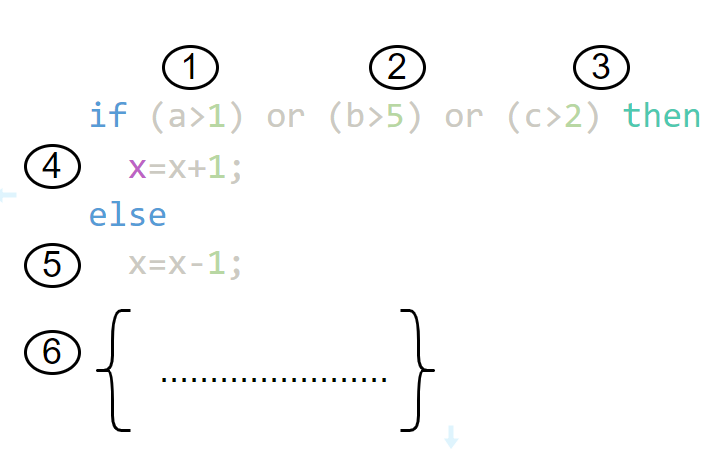
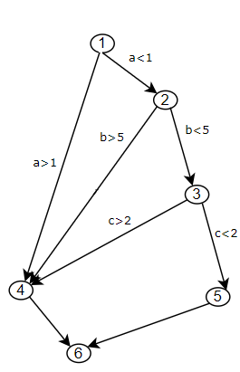
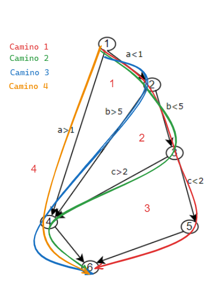

# Caso práctico CS3.1
## Ejercicios Caja Blanca, camino básico y complejidad ciclomática

## Ejercicio 1

```java	
public class Maximo {

  public static void main(String[] args) {

      BufferedReader br = new BufferedReader(new InputStreamReader(System.in));

      Int x, y, z, max;

      System.out.println("Introduce x,y,z: ");
      x = Integer.parseInt(br.readLine());
      y = Integer.parseInt(br.readLine());
      z = Integer.parseInt(br.readLine());

      if (x>y && x>z) {
          max = x;
      } else {
          if (z>y) {
              max = z;
          } else {
              max = y;
          }
      }

      System.out.println("El maximo es: " + max);
  }
}
```

**Se pide:**

### a) Calcular la complejidad ciclomática de McCabe. V(G)

Para calcular la complejidad ciclomática de McCabe, lo primoer que tenemos que hacer es dibujar el grafo de flujo. Para esto seguiremos los siguientes pasos:

1. Selañar en el código los pasos para dibujar el grafo de flujo
   
<p align="center" width="100%">
    
</p>
  
2. Dibujar el grafo de flujo

<p align="center" width="100%">
    
</p>


1. Calcular la complejidad ciclomática de McCabe

   - `Por la formula V(G) = E - N + 2P`, donde E es el número de aristas, N es el número de nodos y P es el número de componentes conexos, podemos calcular la complejidad ciclomática de McCabe.

     V(G) = 9 - 7 + 2*1 = 4

   - `Por la formula V(G) = R + 1`, donde R es el número de regiones, podemos calcular la complejidad ciclomática de McCabe.

     V(G) = 3 + 1 = 4

  - `Por la formula V(G) = P + 2`, donde P es el número de predicados, podemos calcular la complejidad ciclomática de McCabe.

     V(G) = 2 + 2 = 4


Por lo tango tendremos 4 caminos independientes en el código. Los caminos los realizamos a partir del camino más largo, y después vamos recorriendo el grafo hacía atrás.

   1. Camino 1: 1-2-3-5-7-8
   2. Camino 2: 1-2-3-5-6-8
   3. Camino 3: 1-2-3-4-8
   4. Camino 4: 1-2-5-7-8
   

<p align="center" width="100%">
    
</p>


#### b) Definir conjuntos de pruebas mínimo para alcanzar los siguientes criterios de cobertura:

   - Criterio de cobertura de sentencias
   - Criterio de cobertura de decisiones/ramas
   - Criterio de cobertura de caminos

##### 1. Cobertura de sentencias

Se trata de ejecutar todas las sentencias del programa al menos una vez. Para ello, se necesitará un conjunto de pruebas que ejecute el programa con los valores de entrada que permitan recorrer todas las sentencias del programa.

En este caso con los caminos 1, 2 y 3 se recorren todas las sentencias del programa.

Tabla de pruebas con caminos y características:

| Camino | x   | y   | z   | Caracteristicas |
| ------ | --- | --- | --- | --------------- |
| 1      | 10  | 3   | 3   | x>y             |
| 2      | 5   | 2   | 10  | x>y, z>y        |
| 3      | 5   | 10  | 5   | x>y, x>z        |


##### 2. Cobertura de decisiones/ramas

Se trata de ejecutar todas las decisiones del programa para que cada condición tenga al menos un resultado verdaderos y otro falso. 

> 🔥 En el caso con los caminos 1, 2 y 3 existe una condición/valor que no se prueba, Nodo 2, valor False.

Para ello necesitamos ejecutar todos los caminos 1, 2, 3 y 4.


#### 3. Cobertura de caminos

Se trata de ejecutar todos los caminos del programa.

Para ello necesitamos ejecutar todos los caminos 1, 2, 3 y 4.

Tabla de pruebas con caminos y características:

| Camino | x   | y   | z   | Caracteristicas |
| ------ | --- | --- | --- | --------------- |
| 1      | 10  | 3   | 3   | x>y             |
| 2      | 5   | 2   | 10  | x>y, x<z, z>y   |
| 3      | 5   | 10  | 5   | x>y, x>z        |
| 4      | 5   | 10  | 5   | x<y, z<y        |


## Ejercicio 2

Dato el siguiente fragmento de programa en Java:


```java	

if (a>1) and (b>5) and (c>2) then
  x = x +1;
else
  x=x+1;
```

**Se pide:**

#### ¿ Qué criterios de cobertura satisfacen los siguietnes casos de prueba `{a=0, b=11, c=1}`, `{a=4. b=4, c=4}`, `{a=2, b=6, c=0}` ? Explicar cada uno de ellos.


Para esto 1º hay que calcular el Grafo de flujo y la complejidad ciclomática, de la misma manera que en el ejercicio anterior. De esta forma vemos con má facilidad cuales son los pasos que se ejecutann con los casos de prueba que nos dan.

1. Selañar en el código los pasos para dibujar el grafo de flujo

<p align="center" width="100%">
    
</p>

Incluimos un 6º nodo que hace referencia al código que supuestamente viene después (en el enunciado no lo determina). De esta manera podremos cacular la complejidad ciclomática.


2. Dibujar el grafo de flujo

<p align="center" width="100%">
    
</p>

3. Calcular la complejidad ciclomática de McCabe

    - V(G) = 8 - 6 + 2 = 4 caminos independientes

    - Camino 1: 1-2-3-4-6
    - Camino 2: 1-2-3-5-6
    - Camino 3: 1-2-5-6
    - Camino 4: 1-5-6
  
  
<p align="center" width="100%">
    
</p>

- **Caso de prueba {a=0, b=11, c=1}**:  Ejecuta el camino 4, ya que `a` no es mayor que 1, por lo que se ejecuta el `else` y `x` se decrementa en 1.
- **Caso de prueba {a=4. b=4, c=4}**: Ejecuta el camino 3.
- **Caso de prueba {a=2, b=6, c=0}**: Ejecuta el camino 1.

##### Cobertura de sentencias

Se trata de ejecutar con los casos de prueba cada sentencia e instrucción al menos una vez.

- **Caso de prueba {a=0, b=11, c=1}**: Ejecuta el camino 4. (Sentencias 1, 5, 6)
- **Caso de prueba {a=2, b=6, c=0}**: Ejecuta el camino 1. (Sentencias 1, 2, 3, 4, 6)
- **Caso de prueba {a=4. b=4, c=4}**: Ejecuta el camino 3. (Sentencias 1, 2, 5, 6)


Con estos casos de prueba, se cubren todas las sentencias del programa.

##### Cobertura de decisiones/ramas

Se trata de ejecutar con los casos de prueba todas las decisiones del programa para que cada condición tenga al menos un resultado verdadero y otro falso.

- **Caso de prueba {a=0, b=11, c=1}**: Ejecuta el camino 4. (Decisiones 1F)
- **Caso de prueba {a=2, b=6, c=0}**: Ejecuta el camino 1. (Decisiones 1T, 2T, 3F)
- **Casos de prueba {a=4. b=4, c=4}**: Ejecuta el camino 3. (Decisiones 1T, 2F)

Se puede observar que estos casos de prueba NO se cubren todas las decisiones del programa. `La decisión 3F no se ha ejecutado`, por lo que sería necesario realizar otro caso de prueba para cubrir esta decisión.

##### Cobertura de caminos

Se trata de ejecutar con los casos de prueba todos los caminos del programa.

Para ello necesitamos ejecutar todos los caminos que como mínimo debemos realizar, según nos indica la `complejidad ciclomática de McCabe`.


## Ejercicio 3

Dado el mismo framento de código del ejercicio anterior, pero ahora con 2 cláusulas OR, calcular el número mínimo de casos de prueba que es necesario para que se cumpla la cobertura de condiciones.

1. Selañar en el código los pasos para dibujar el grafo de flujo

<p align="center" width="100%">
    
</p>

2. Dibujar el grafo de flujo

<p align="center" width="100%">
    
</p>

3. Calcular la complejidad ciclomática de McCabe


<p align="center" width="100%">
    
</p>


En esta ocasión la calculamos a través de las regiones. 

    - V(G) = 4 reginos

    - Camino 1: 1-2-3-5-6
    - Camino 2: 1-2-3-4-6
    - Camino 3: 1-2-4-6
    - Camino 4: 1-4-6

Para cubrir todas las condiciones, necesitamos un caso de prueba para cada camino independiente. **Por lo tanto, necesitamos 4 casos de prueba.**
