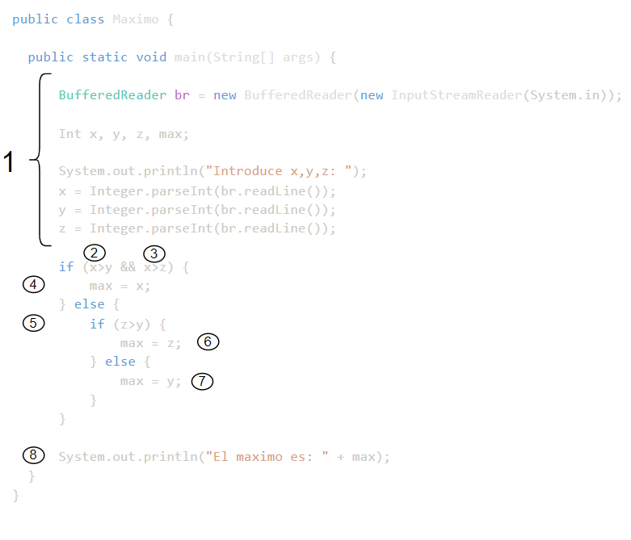
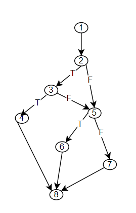
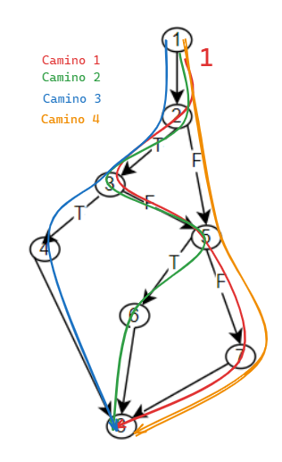

# sdfsfd

## Ejercicio 1

```java	
public class Maximo {

  public static void main(String[] args) {

      BufferedReader br = new BufferedReader(new InputStreamReader(System.in));

      Int x, y, z, max;

      System.out.println("Introduce x,y,z: ");
      x = Integer.parseInt(br.readLine());
      y = Integer.parseInt(br.readLine());
      z = Integer.parseInt(br.readLine());

      if (x>y && x>z) {
          max = x;
      } else {
          if (z>y) {
              max = z;
          } else {
              max = y;
          }
      }

      System.out.println("El maximo es: " + max);
  }
}
```

**Se pide:**

### a) Calcular la complejidad ciclomática de McCabe. V(G)

Para calcular la complejidad ciclomática de McCabe, lo primoer que tenemos que hacer es dibujar el grafo de flujo. Para esto seguiremos los siguientes pasos:

1. Selañar en el código los pasos para dibujar el grafo de flujo
   
<p align="center" width="100%">
    
</p>
  
2. Dibujar el grafo de flujo

<p align="center" width="100%">
    
</p>


1. Calcular la complejidad ciclomática de McCabe

   - `Por la formula V(G) = E - N + 2P`, donde E es el número de aristas, N es el número de nodos y P es el número de componentes conexos, podemos calcular la complejidad ciclomática de McCabe.

     V(G) = 9 - 7 + 2*1 = 4

   - `Por la formula V(G) = R + 1`, donde R es el número de regiones, podemos calcular la complejidad ciclomática de McCabe.

     V(G) = 3 + 1 = 4

  - `Por la formula V(G) = P + 2`, donde P es el número de predicados, podemos calcular la complejidad ciclomática de McCabe.

     V(G) = 2 + 2 = 4


Por lo tango tendremos 4 caminos independientes en el código. Los caminos los realizamos a partir del camino más largo, y después vamos recorriendo el grafo hacía atrás.

   1. 1-2-3-5-7-8
   2. 1-2-3-5-6-8
   3. 1-2-3-4-8
   4. 1-2-5-7-8
   

<p align="center" width="100%">
    
</p>


#### b) Definir conjuntos de pruebas mínimo para alcanzar los siguientes criterios de cobertura:

   - Criterio de cobertura de sentencias
   - Criterio de cobertura de decisiones/ramas
   - Criterio de cobertura de caminos

##### 1. Cobertura de sentencias

Se trata de ejecutar todas las sentencias del programa al menos una vez. Para ello, se necesitará un conjunto de pruebas que ejecute el programa con los valores de entrada que permitan recorrer todas las sentencias del programa.

En este caso con los caminos 1, 2 y 3 se recorren todas las sentencias del programa.

Tabla de pruebas con caminos y características:

| Camino | x   | y   | z   | Caracteristicas |
| ------ | --- | --- | --- | --------------- |
| 1      | 10  | 3   | 3   | x>y             |
| 2      | 5   | 2   | 10  | x>y, z>y        |
| 3      | 5   | 10  | 5   | x>y, x>z        |


##### 2. Cobertura de decisiones/ramas

Se trata de ejecutar todas las decisiones del programa para que cada condición tenga al menos un resultado verdaderos y otro falso. 

> 🔥 En el caso con los caminos 1, 2 y 3 existe una condición/valor que no se prueba, Nodo 2, valor False.

Para ello necesitamos ejecutar todos los caminos 1, 2, 3 y 4.


#### 3. Cobertura de caminos

Se trata de ejecutar todos los caminos del programa.

Para ello necesitamos ejecutar todos los caminos 1, 2, 3 y 4.

Tabla de pruebas con caminos y características:

| Camino | x   | y   | z   | Caracteristicas |
| ------ | --- | --- | --- | --------------- |
| 1      | 10  | 3   | 3   | x>y             |
| 2      | 5   | 2   | 10  | x>y, x<z, z>y   |
| 3      | 5   | 10  | 5   | x>y, x>z        |
| 4      | 5   | 10  | 5   | x<y, z<y        |

