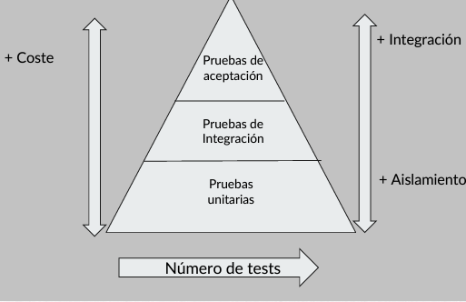

# UNIT TESTING JAVA (JUNIT)

## Introducción

Las pruebas unitarias son una técnica de programación que consiste en realizar pruebas automatizadas para verificar el correcto funcionamiento de una unidad de código. Una unidad de código puede ser un método, una clase, un paquete, un componente, etc. Las pruebas unitarias se realizan de forma aislada, es decir, se prueban las unidades de código de forma independiente, sin depender de otras unidades de código o componentes.

### Testing tradicional

El testing tradicional se realiza de forma manual:

- Directamente desde el código fuente.
- Via app móvil o web.
- Con herramientas como POSTSMAN para API Rest.

En general podemos decir que:

- Requieren mucho tiempo y es lento. A medida que la aplicación crece, el tiempo de pruebas también crece.
- No nos reporta si falla, dónde y por qué
- Habrá que repetir las pruebas cada vez que se haga un cambio en el código.
- No se pueden automatizar.
- Habrá casos de uso que no se prueben, o que se prueben unas veces y otras no.

### Testing automatizado

Las características del testing automatizado son:

- Automático y rápido.
- Nos permite disponer de un conjunto de pruebas definido.
- Nos ofrece un reporte de las pruebas.
  - Si falla, dónde y pro qué.
- Nos garantiza su funcionamiento tras cambios.

## Tipos de Test

- Pruebas unitarias
  - Menor coste
  - Mayor número de test.
  - Máximo aislamiento.
- Integración
- Aceptación
  - Más coste.
    - Menor número de test.
    - Máxima integración.

### Requisitos para hacer Testing

- Comprender el funcionamiento de nuestra aplicación
- Conocer cuáles son nuestras clases.
- Reglas de negocio o casos de uso.

### Pruebas unitarias

- Métodos que permite verificar una parte del código.
- Comprueban que, para unos datos de entrada, devuelve el resultado esperado.
- Permiten la veridicación de las reglas de negocio de forma aislada.

**¿Qué es una prueba?**

Las pruebas unitarias casi siempre se centran en pruebas de "Caja Negra", donde para unos datos de entrada se esperan unos datos de salida.

### JUnit

Realizar las pruebas de forma manual puede ser tedioso y propenso a errores. Por ello, existen frameworks que facilitan la creación y ejecución de pruebas unitarias. Uno de los frameworks más populares para realizar pruebas unitarias en Java es JUnit.

Aparte de JUnit, existen otros frameworks de pruebas unitarias en Java, como TestNG, Mockito, PowerMock, etc, pero por su popularidad y simplicidad, JUnit es el más utilizado.

JUnit es un framework de pruebas unitarias para el lenguaje de programación Java

Características de JUnit:

- Permite escribir y ejecutar pruebas unitarias de forma sencilla.
- Proporciona anotaciones para definir métodos de prueba.
- Proporciona métodos de aserción para verificar los resultados de las pruebas.
- Proporciona herramientas para la ejecución de pruebas y la generación de informes.
- Proporciona herramientas para la organización de pruebas en suites de pruebas.
- Las pruebas son repetibles y se pueden ejecutar de forma automática.

### Instalación de JUnit

Para utilizar JUnit en un proyecto Java, es necesario añadir la librería de JUnit al proyecto, y esto se puede realizar de varias formas:

- Manualmente añadiendo el archivo JAR de JUnit al proyecto.
- Utilizando una herramienta de gestión de dependencias como Maven o Gradle.

#### JUNIT 4 vs JUNIT 5

JUnit 4 es la versión anterior de JUnit, y JUnit 5 es la versión más reciente de JUnit. JUnit 5 es una versión completamente nueva de JUnit que se lanzó en septiembre de 2017. JUnit 5 es una reescritura completa de JUnit 4 y ofrece muchas nuevas características y mejoras sobre JUnit 4.

A continuación, se muestra una tabla comparativa de las características de JUnit 4 y JUnit 5:

| Característica | JUnit 4 | JUnit 5 |
| --- | --- | --- |
| Arquitectura | Basada en JUnit 3 | Basada en JUnit Platform |
| Anotaciones | @Test, @Before, @After, @BeforeClass, @AfterClass | @Test, @BeforeEach, @AfterEach, @BeforeAll, @AfterAll |
| Extensiones | No | Sí |
| Anotaciones de extensión | No | @ExtendWith |
| Anotaciones de repetición | No | @RepeatedTest |
| Anotaciones de parámetros | No | @ParameterizedTest |
| Anotaciones de excepción | @Test(expected = Exception.class) | @Test(expected = Exception.class) |
| Anotaciones de tiempo de espera | @Test(timeout = 1000) | @Test(timeout = 1000) |
| Anotaciones de deshabilitación | @Ignore | @Disabled |
| Anotaciones de etiquetas | No | @Tag |
| Anotaciones de anidamiento | No | @Nested |
| Anotaciones de prueba condicional | No | @EnabledOnOs, @EnabledOnJre, @EnabledIf, @EnabledIfSystemProperty, @EnabledIfEnvironmentVariable |
| Anotaciones de inyección de dependencias | No | @RegisterExtension |
| Anotaciones de configuración de extensión | No | @RegisterExtension |
| Anotaciones de manejo de excepciones | No | @ExceptionHandler |
| Anotaciones de tiempo de vida de la extensión | No | @ExtendWith |
| Anotaciones de prueba de interfaz funcional | No | @Testable |

#### JUnit 5

Anotaciones más importantes de JUnit 5:

- @Test: Indica que el método es un método de prueba.
- @BeforeEach: Indica que el método se ejecuta antes de cada método de prueba.
- @AfterEach: Indica que el método se ejecuta después de cada método de prueba.
- @BeforeAll: Indica que el método se ejecuta antes de todos los métodos de prueba.
- @AfterAll: Indica que el método se ejecuta después de todos los métodos de prueba.

Otras anotaciones de JUnit 5:

- @DisplayName: Permite definir un nombre personalizado para el método de prueba.
- @Disabled: Indica que el método de prueba está deshabilitado.
- @Ignore: Indica que el método de prueba está deshabilitado.
- @Order: Indica el orden de ejecución de los métodos de prueba.
- @EnabledOnOs: Indica que el método de prueba se ejecuta en un sistema operativo específico.
- @EnabledOnJre: Indica que el método de prueba se ejecuta en una versión específica de la JVM.
- @RepeatedTest: Indica que el método de prueba se repite un número específico de veces.
- @ParameterizedTest: Indica que el método de prueba se ejecuta con diferentes parámetros.
- @Tag: Permite etiquetar los métodos de prueba. Se pueden agrupar los métodos de prueba por etiquetas y ejecutar solo los métodos de prueba que tengan una etiqueta específica.
- @Nested: Permite anidar clases de prueba. Se pueden anidar clases de prueba para organizar las pruebas de forma jerárquica. Cada clase de prueba anidada se ejecuta de forma independiente.

