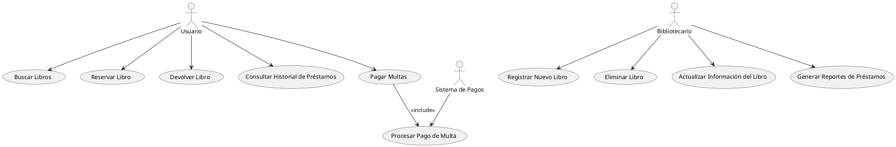
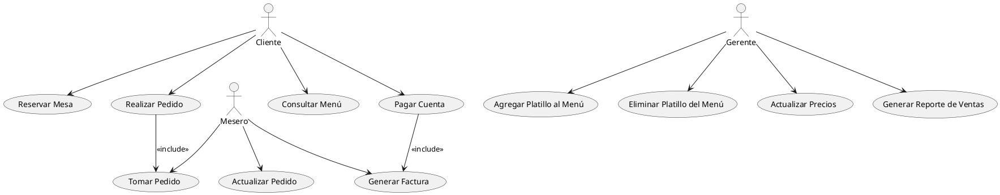

## Ejercicios Guiados Casos de Uso

### Teoría

Un `caso de uso` es una descripción de cómo un usuario o un sistema externo interactúa con un sistema para lograr un objetivo específico. Es una herramienta fundamental en la ingeniería de software para capturar los requisitos funcionales de un sistema y describir las interacciones entre los actores (usuarios u otros sistemas) y el sistema en sí. Un caso de uso generalmente incluye una serie de pasos que detallan la secuencia de interacciones entre el actor y el sistema, así como las posibles variaciones y excepciones.

**Componentes de un Caso de Usos**

1. `Nombre del Caso de Uso`: Un título claro y conciso que describe el objetivo del caso de uso.
2. `Actor(es)`: Las entidades externas que interactúan con el sistema (pueden ser usuarios o sistemas externos).
3. `Precondiciones`: Las condiciones que deben ser verdaderas antes de que el caso de uso pueda comenzar.
4. `Postcondiciones`: Las condiciones que serán verdaderas después de que el caso de uso haya terminado.
5. `Flujo Principal de Eventos`: La secuencia de pasos que describe la interacción principal entre el actor y el sistema.
6. `Flujos Alternativos`: Descripciones de las variaciones posibles en la interacción principal.

## Ejercicio Resuelto 1

El objetivo de este ejercicio es diseñar un sistema de gestión de biblioteca utilizando diagramas de casos de uso. Este sistema permitirá a los usuarios y bibliotecarios interactuar con una variedad de funcionalidades que facilitan la gestión de libros, el procesamiento de préstamos y la administración de pagos de multas. También se incluye la integración con un sistema de pagos externo para procesar las multas.

**Actores y Casos de Uso:**

1. *Usuario:*

   - `Buscar Libros`: El usuario puede buscar libros en la biblioteca utilizando diversos criterios de búsqueda como título, autor, género, etc.
   - `Reservar Libro`: Una vez que el usuario encuentra un libro, puede reservarlo si está disponible.
   - `Devolver Libro`: El usuario puede devolver los libros que ha prestado.
   - `Consultar Historial de Préstamos`: El usuario puede consultar un historial de todos los libros que ha tomado prestados y devuelto.
   - Pagar Multas: Si el usuario tiene multas por retrasos en la devolución de libros, puede pagarlas.
  
2. *Bibliotecario:*

   - `Registrar Nuevo Libro`: El bibliotecario puede registrar nuevos libros en el sistema.
   - `Eliminar Libro`: El bibliotecario puede eliminar libros del sistema.
   - `Actualizar Información del Libro`: El bibliotecario puede actualizar la información de los libros existentes.
   - `Generar Reportes de Préstamos`: El bibliotecario puede generar reportes sobre los préstamos realizados, incluyendo   - información sobre los libros más prestados, usuarios con más préstamos, etc.

3. *Sistema de Pagos*:

   - `Procesar Pago de Multa`: Este sistema externo se encarga de procesar los pagos de las multas generadas por los usuarios.

### **Diagrama de Casos de Uso:**

El siguiente diagrama de casos de uso en PlantUML muestra cómo los diferentes actores interactúan con el sistema:

**Explicación del Diagrama**

* `Usuario`: Este actor tiene acceso a cinco funcionalidades principales: buscar libros, reservar libros, devolver libros, consultar su historial de préstamos y pagar multas.
* `Bibliotecario`: Este actor tiene acceso a cuatro funcionalidades principales: registrar nuevos libros, eliminar libros, actualizar información de libros y generar reportes de préstamos.
* `Sistema de Pagos`: Este actor externo se encarga de procesar los pagos de multas cuando un usuario decide pagar una multa.
* `Relaciones entre Casos de Uso`: La relación de inclusión (<<include>>) entre "Pagar Multas" y "Procesar Pago de Multa" indica que para pagar una multa, el sistema debe necesariamente procesar el pago utilizando el sistema de pagos externo.

## Ejercicio Resuelto 2

El objetivo de este ejercicio es diseñar un sistema de gestión de restaurante utilizando diagramas de casos de uso. Este sistema permitirá a los clientes, meseros y al gerente interactuar con diversas funcionalidades que facilitan la gestión de reservas, pedidos y administración del restaurante.

### Actores y Casos de Uso:

*Cliente:*

  - `Reservar Mesa`: El cliente puede hacer una reserva de mesa para una fecha y hora específicas.
  - `Realizar Pedido`: El cliente puede realizar un pedido desde su mesa.
  - `Pagar Cuenta`: El cliente puede pagar la cuenta de su pedido.
  - `Consultar Menú`: El cliente puede consultar el menú del restaurante.

*Camarero*

  - `Tomar Pedido`: El mesero toma el pedido del cliente y lo ingresa al sistema.
  - `Actualizar Pedido`: El mesero puede actualizar el pedido del cliente.
  - `Generar Factura`: El mesero puede generar la factura para el cliente.

*Gerente:*

  - `Agregar Platillo` al Menú: El gerente puede agregar nuevos platillos al menú del restaurante.
  - `Eliminar Platillo` del Menú: El gerente puede eliminar platillos del menú.
  - `Actualizar Precios`: El gerente puede actualizar los precios de los platillos en el menú.
  - `Generar Reporte` de Ventas: El gerente puede generar reportes de ventas diarias, semanales o mensuales.

### **Diagrama de Casos de Uso:**

El siguiente diagrama de casos de uso en PlantUML muestra cómo los diferentes actores interactúan con el sistema:

Explicación del Diagrama:

- `Cliente`: Este actor tiene acceso a cuatro funcionalidades principales: reservar mesa, realizar pedido, pagar cuenta y consultar el menú.
- `Mesero`: Este actor tiene acceso a tres funcionalidades principales: tomar pedidos, actualizar pedidos y generar facturas.
- `Gerente`: Este actor tiene acceso a cuatro funcionalidades principales: agregar platillos al menú, eliminar platillos del menú, actualizar precios y generar reportes de ventas.
- `Relaciones` entre Casos de Uso:
  - La relación de inclusión (<<include>>) entre "Realizar Pedido" y "Tomar Pedido" indica que cuando un cliente realiza un pedido, un mesero debe tomar el pedido.
  - La relación de inclusión (<<include>>) entre "Pagar Cuenta" y "Generar Factura" indica que para pagar la cuenta, se debe generar una factura.
