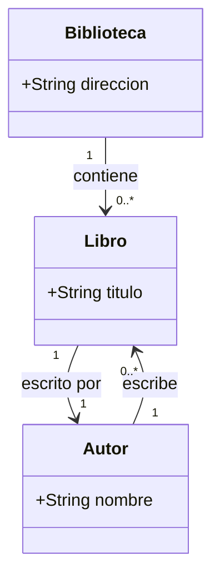
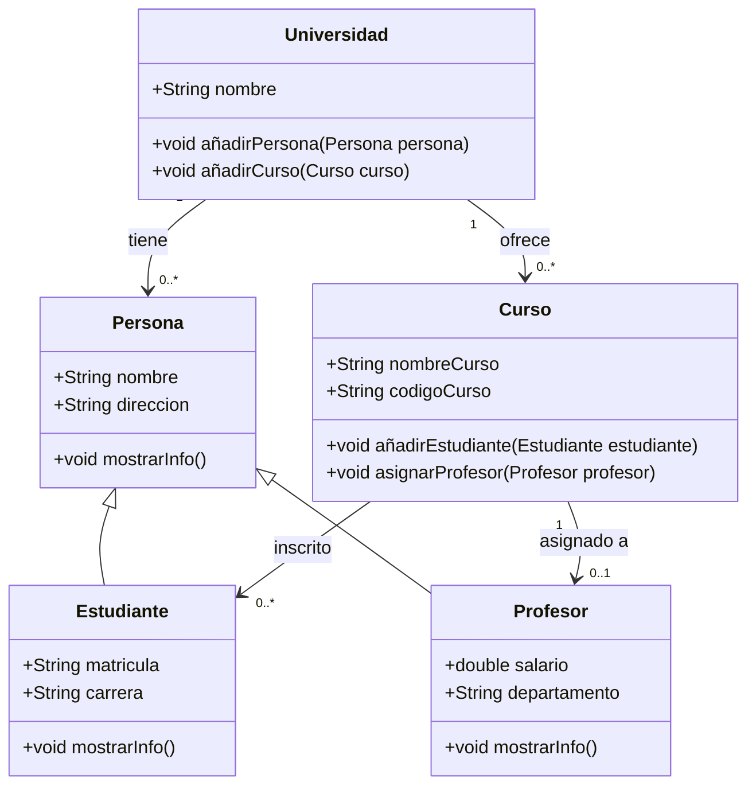
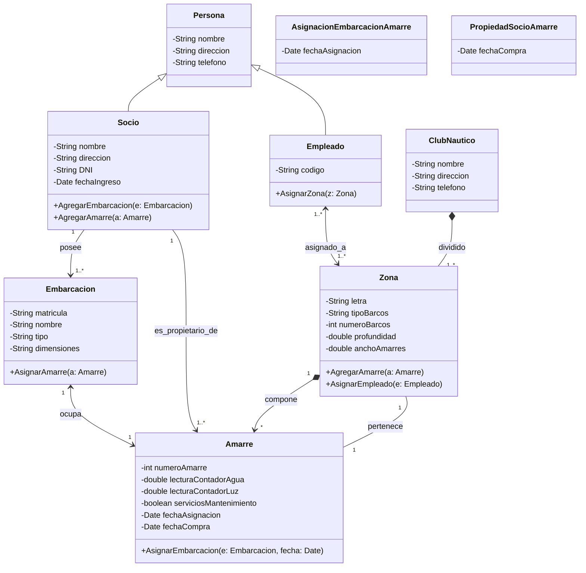
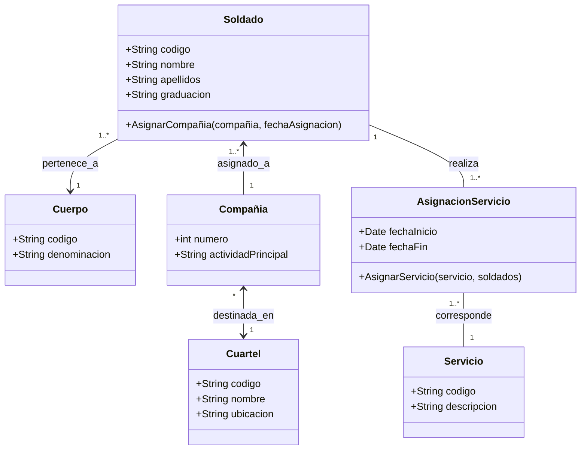
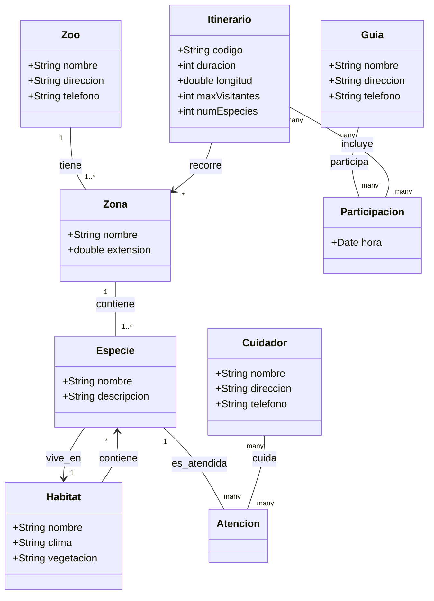

## Ejercicios Guiados Diagramas de Clases

### Teoría

Un `diagrama de clases` es una representación visual de las clases, interfaces, asociaciones y relaciones entre objetos en un sistema de software. Es una herramienta fundamental en la ingeniería de software para modelar la estructura estática de un sistema y capturar las relaciones entre las entidades del sistema.	

**Componentes de un Diagrama de Clases**

1. `Clases`: Representan las entidades del sistema y contienen atributos y métodos.
2. `Atributos`: Propiedades de una clase que describen el estado de un objeto.
3. `Métodos`: Comportamientos de una clase que definen las operaciones que un objeto puede realizar.
4. `Relaciones`: Diversos tipos de relaciones entre clases, como asociación, agregación, composición y dependencia.
5. `Asociaciones`: Relaciones entre clases que indican cómo se relacionan los objetos.
6. `Herencia`: Relación entre una clase base (superclase) y una clase derivada (subclase) que indica que la subclase hereda atributos y métodos de la superclase.
7. `Interfaz`: Una colección de métodos abstractos que define un comportamiento común para las clases que la implementan.


## Ejercicio Resuelto 1

Modela un diagrama de clases para una biblioteca. Cada biblioteca tiene una dirección y una colección de libros. Cada libro tiene un título y un autor. Un autor puede haber escrito varios libros, y cada libro es escrito por un solo autor.

**Clases:**

1. Clases:

   - Biblioteca
   - Libro
   - Autor

2. Atributos:

   - Biblioteca: direccion
   - Libro: titulo
   - Autor: nombre
  
3. Relaciones:

   - Una biblioteca tiene una colección de libros (1 biblioteca a muchos libros).
   - Un libro tiene un autor (muchos libros a 1 autor).
   - Un autor puede haber escrito varios libros (1 autor a muchos libros).


### **Diagrama de Clases:**



### **Código Java:**

```java
import java.util.List;

public class Biblioteca {
    private String direccion;
    private List<Libro> libros;

    public Biblioteca(String direccion, List<Libro> libros) {
        this.direccion = direccion;
        this.libros = libros;
    }

    public String getDireccion() {
        return direccion;
    }

    public void setDireccion(String direccion) {
        this.direccion = direccion;
    }

    public List<Libro> getLibros() {
        return libros;
    }

    public void setLibros(List<Libro> libros) {
        this.libros = libros;
    }

    public void addLibro(Libro libro) {
        this.libros.add(libro);
    }
}

public class Libro {
    private String titulo;
    private Autor autor;

    public Libro(String titulo, Autor autor) {
        this.titulo = titulo;
        this.autor = autor;
    }

    public String getTitulo() {
        return titulo;
    }

    public void setTitulo(String titulo) {
        this.titulo = titulo;
    }

    public Autor getAutor() {
        return autor;
    }

    public void setAutor(Autor autor) {
        this.autor = autor;
    }
}

import java.util.List;
import java.util.ArrayList;

public class Autor {
    private String nombre;
    private List<Libro> libros;

    public Autor(String nombre) {
        this.nombre = nombre;
        this.libros = new ArrayList<>();
    }

    public String getNombre() {
        return nombre;
    }

    public void setNombre(String nombre) {
        this.nombre = nombre;
    }

    public List<Libro> getLibros() {
        return libros;
    }

    public void addLibro(Libro libro) {
        this.libros.add(libro);
    }
}
```
Ejemplo de uso, de esa estructura de clases:

```java
import java.util.ArrayList;
import java.util.List;

public class Main {
    public static void main(String[] args) {
        // Crear autor
        Autor autor1 = new Autor("Gabriel Garcia Marquez");

        // Crear libros
        Libro libro1 = new Libro("Cien Años de Soledad", autor1);
        Libro libro2 = new Libro("El amor en los tiempos del cólera", autor1);

        // Añadir libros al autor
        autor1.addLibro(libro1);
        autor1.addLibro(libro2);

        // Crear lista de libros para la biblioteca
        List<Libro> libros = new ArrayList<>();
        libros.add(libro1);
        libros.add(libro2);

        // Crear biblioteca
        Biblioteca biblioteca = new Biblioteca("Calle Falsa 123", libros);

        // Mostrar información de la biblioteca
        System.out.println("Biblioteca en " + biblioteca.getDireccion());
        System.out.println("Libros disponibles:");

        for (Libro libro : biblioteca.getLibros()) {
            System.out.println("- " + libro.getTitulo() + " por " + libro.getAutor().getNombre());
        }
    }
}
```


## Ejercicio Resuelto 2

Modela un diagrama de clases para un sistema de gestión de una universidad. Debe incluir las clases Persona, Estudiante, Profesor, Curso y Universidad. Persona es una clase base que tiene atributos comunes a estudiantes y profesores. Estudiante y Profesor heredan de Persona. La Universidad tiene una lista de personas (estudiantes y profesores) y una lista de cursos. Cada curso puede tener varios estudiantes y un profesor asignado. Implementa métodos para añadir estudiantes a cursos y asignar profesores a cursos.

**Clases:**

- Persona: clase base con atributos comunes a todas las personas (nombre, dirección).
- Estudiante: hereda de Persona, con atributos adicionales (matrícula, carrera).
- Profesor: hereda de Persona, con atributos adicionales (salario, departamento).
- Curso: con atributos (nombre del curso, código del curso) y métodos (añadir estudiante, asignar profesor).
- Universidad: con atributos (nombre, lista de personas) y métodos (añadir persona, añadir curso).


### **Diagrama de Clases:**



### **Código Java:**

```java
public class Persona {
    private String nombre;
    private String direccion;

    public Persona(String nombre, String direccion) {
        this.nombre = nombre;
        this.direccion = direccion;
    }

    public String getNombre() {
        return nombre;
    }

    public void setNombre(String nombre) {
        this.nombre = nombre;
    }

    public String getDireccion() {
        return direccion;
    }

    public void setDireccion(String direccion) {
        this.direccion = direccion;
    }

    public void mostrarInfo() {
        System.out.println("Nombre: " + nombre + ", Dirección: " + direccion);
    }
}


public class Estudiante extends Persona {
    private String matricula;
    private String carrera;

    public Estudiante(String nombre, String direccion, String matricula, String carrera) {
        super(nombre, direccion);
        this.matricula = matricula;
        this.carrera = carrera;
    }

    public String getMatricula() {
        return matricula;
    }

    public void setMatricula(String matricula) {
        this.matricula = matricula;
    }

    public String getCarrera() {
        return carrera;
    }

    public void setCarrera(String carrera) {
        this.carrera = carrera;
    }

    @Override
    public void mostrarInfo() {
        super.mostrarInfo();
        System.out.println("Matrícula: " + matricula + ", Carrera: " + carrera);
    }
}

public class Profesor extends Persona {
    private double salario;
    private String departamento;

    public Profesor(String nombre, String direccion, double salario, String departamento) {
        super(nombre, direccion);
        this.salario = salario;
        this.departamento = departamento;
    }

    public double getSalario() {
        return salario;
    }

    public void setSalario(double salario) {
        this.salario = salario;
    }

    public String getDepartamento() {
        return departamento;
    }

    public void setDepartamento(String departamento) {
        this.departamento = departamento;
    }

    @Override
    public void mostrarInfo() {
        super.mostrarInfo();
        System.out.println("Salario: " + salario + ", Departamento: " + departamento);
    }
}


import java.util.ArrayList;
import java.util.List;

public class Curso {
    private String nombreCurso;
    private String codigoCurso;
    private Profesor profesor;
    private List<Estudiante> estudiantes;

    public Curso(String nombreCurso, String codigoCurso) {
        this.nombreCurso = nombreCurso;
        this.codigoCurso = codigoCurso;
        this.estudiantes = new ArrayList<>();
    }

    public String getNombreCurso() {
        return nombreCurso;
    }

    public void setNombreCurso(String nombreCurso) {
        this.nombreCurso = nombreCurso;
    }

    public String getCodigoCurso() {
        return codigoCurso;
    }

    public void setCodigoCurso(String codigoCurso) {
        this.codigoCurso = codigoCurso;
    }

    public Profesor getProfesor() {
        return profesor;
    }

    public void asignarProfesor(Profesor profesor) {
        this.profesor = profesor;
    }

    public List<Estudiante> getEstudiantes() {
        return estudiantes;
    }

    public void añadirEstudiante(Estudiante estudiante) {
        this.estudiantes.add(estudiante);
    }
}


import java.util.ArrayList;
import java.util.List;

public class Universidad {
    private String nombre;
    private List<Persona> personas;
    private List<Curso> cursos;

    public Universidad(String nombre) {
        this.nombre = nombre;
        this.personas = new ArrayList<>();
        this.cursos = new ArrayList<>();
    }

    public String getNombre() {
        return nombre;
    }

    public void setNombre(String nombre) {
        this.nombre = nombre;
    }

    public List<Persona> getPersonas() {
        return personas;
    }

    public void añadirPersona(Persona persona) {
        this.personas.add(persona);
    }

    public List<Curso> getCursos() {
        return cursos;
    }

    public void añadirCurso(Curso curso) {
        this.cursos.add(curso);
    }
}
```

Ejemplo de uso, de esa estructura de clases:

```java
public class Main {
    public static void main(String[] args) {
        // Crear universidad
        Universidad universidad = new Universidad("Universidad Nacional");

        // Crear profesor
        Profesor profesor1 = new Profesor("Juan Perez", "Calle 1", 50000, "Matemáticas");
        universidad.añadirPersona(profesor1);

        // Crear estudiantes
        Estudiante estudiante1 = new Estudiante("Maria Lopez", "Calle 2", "12345", "Ingeniería");
        Estudiante estudiante2 = new Estudiante("Carlos Gomez", "Calle 3", "67890", "Física");
        universidad.añadirPersona(estudiante1);
        universidad.añadirPersona(estudiante2);

        // Crear curso
        Curso curso1 = new Curso("Álgebra", "MAT101");
        universidad.añadirCurso(curso1);

        // Asignar profesor al curso
        curso1.asignarProfesor(profesor1);

        // Añadir estudiantes al curso
        curso1.añadirEstudiante(estudiante1);
        curso1.añadirEstudiante(estudiante2);

        // Mostrar información del curso
        System.out.println("Curso: " + curso1.getNombreCurso() + " (" + curso1.getCodigoCurso() + ")");
        System.out.println("Profesor: " + curso1.getProfesor().getNombre());
        System.out.println("Estudiantes inscritos:");

        for (Estudiante estudiante : curso1.getEstudiantes()) {
            estudiante.mostrarInfo();
        }
    }
}
```	

## Ejercicio Resuelto 3

Un club náutico desea tener informatizados los datos correspondientes a sus instalaciones, empleados, socios y embarcaciones que se encuentran en dicho club. El club está organizado de la siguiente forma:

- El club náutico se identifica con nombre y también debe guardarse su dirección y número de teléfono.  
- Los socios pertenecientes al club vienen definidos por su nombre, dirección, DNI, teléfono y fecha de ingreso en el club.  
- Las embarcaciones vienen definidas por: matricula, nombre, tipo y dimensiones.  
- Los amarres tienen como datos de interés el número de amarre, la lectura del contador de agua y luz, y si tienen o no servicios de mantenimiento contratados.  
- Por otro lado, hay que tener en cuenta que una embarcación pertenece a solo un socio, aunque un socio puede tener varias embarcaciones. Una embarcación ocupará solo un amarre y un amarre está ocupado por una sola embarcación. Es importante la fecha en la que una embarcación en asignada a un amarre.  
- Los socios pueden ser propietarios de varios amarres, siendo importante la fecha de compra del amarre. Hay que tener en cuenta que un amarre pertenece a un solo socio y que NO HAY ninguna relación directa entre la fecha en la que se compra un amarre y en la que una embarcación se asigna a un amarre.  
- El club náutico está dividido en varias zonas definidas por una letra, el tipo de barcos que tiene, el número de barcos que contiene, la profundidad y el ancho de los amarres. Una zona está compuesta por varios amarres y un amarre pertenece a una sola zona.  
- En cuanto a los empleados, estos vienen definidos por su código, nombre, dirección y teléfono. Un empleado está asignado a varias zonas y en una zona puede haber más de un empleado, siendo de interés el número de barcos de los que se encarga en cada zona. Hay que tener en cuenta que un empleado puede no encargarse de todos los barcos de una zona.  


### **Diagrama de Clases:**




## Ejericio Resuelto 4

Cierto país desea crear un sistema para gestionar la información de su fuerza militar. Los datos significativos a tener en cuenta son: 


- Un soldado se define por su código de soldado, su nombre y apellidos, y su graduación. 
- Existen varios cuarteles, cada uno se define por su código de cuartel, nombre y ubicación. 
- El ejército está compuesto en cinco cuerpos y cada uno se define por un código de Cuerpo y denominación. 
- Los soldados están agrupados en compañías, siendo significativa para cada una de éstas, el número de compañía y la actividad principal que realiza. 
- Se desea controlar los servicios que realizan los soldados y se definen por el código de servicio y descripción. Un mismo servicio puede ser realizado por más de un soldado (con independencia de la compañía). 
- Cuando un soldado entra en el ejercicio, pertenece a un único cuerpo de forma permanente. Los solados pertenecen a una sola compañía en un momento dado, pero pueden ser reubicados en diferentes compañías. A una compañía pueden pertenecer soldados de diferentes cuerpos, no habiendo relación directa entre compañías y cuerpos. 
- Una compañía está destinada en un cuartel y en un cuartel puede haber varias compañías. 


### **Diagrama de Clases:**



## Ejercicio Resuelto 5

Un zoo necesita una aplicación informática para llevar su organización respecto a las especies que posee, los empleados (cuidadores y guías), y los distintos itinerarios de visita que ofrece. La información está estructurada de la siguiente manera:
  
  - El zoo necesita guardar la información que lo identifica, como su nombre, dirección y teléfono de contacto. El zoo está compuesto por varias zonas.
  
  - `Zonas`: las zonas del zoo en las que se encuentran las distintas especies vienen definidas por el nombre y la extensión que ocupan.  
  - `Especies`: de las especies interesa saber el nombre y una descripción general. Hay que tener en cuenta que una especie puede vivir en diferentes hábitats naturales y que un hábitat puede ser ocupado por diferentes especies. Cada especie está en una zona y en una zona hay varias especies.  
  - `Hábitats`: los diferentes hábitats naturales vienen definidos por el nombre, el clima y el tipo de vegetación predominantes.  
  - `Itinerarios`: los itinerarios discurren por distintas zonas del parque. La información de interés para los itinerarios es: código de itinerario, la duración del recorrido, la longitud del itinerario, el máximo número de visitantes autorizado y el número de distintas especies que visita. Hay que tener en cuenta que un itinerario recorre distintas zonas del parque y que una zona puede ser recorrida por diferentes itinerarios.  
  - `Guías`: los guías del parque vienen definidos por el nombre, dirección y teléfono. Un guía participa en varios itinerarios, cada uno en una hora en concreto, y un itinerario puede ser asignado a diferentes guías.   
  - `Cuidadores`: los cuidadores vienen definidos por el nombre, dirección y teléfono. Hay que tener en cuenta que un cuidador está a cargo de 5 especies como máximo y que una especie tiene que ser atendida por al menos un cuidador. 
  

### **Diagrama de Clases:**




## Ejercicio Propuesto 1

Una cadena de agencias de viajes desea disponer de un sistema que gestione la información de las reservas de hoteles, vueltos y turistas.  

- La cadena de agencias está compuesta por un conjunto de sucursales. Cada sucursal viene definida por el código de sucursal, dirección y teléfono.  
  
- Un turista puede contratar cuantas reservas de viajes quiera, pero cada reserva contiene información de la contratación de solo un hotel y opcionalmente un vuelo de ida y vuelta. Además, una reserva puede incluir a más de un turista.   
- Las reservas se identifican con un código, número de turistas, fecha de entrada y salida del hotel.  
- La agencia gestiona una serie de hoteles de forma exclusiva y son los únicos que ofrece a los clientes para realizar las reservas. Cada hotel estará definido por el código de hotel, nombre, dirección, ciudad, teléfono y número de plazas disponibles.  • Los vuelos no son propiedad de la agencia, pero necesitamos almacenar su información para gestionar la reserva. Cada vuelo viene definido por el número de vuelo, fecha y hora, origen y destino. 
- La información que se desea almacenar por cada turista es el código de turista, nombre, dirección y teléfono.  
- A la cadena de agencias le interesa conocer en qué sucursal ha sido atendido el turista cuando ha realizado la reserva.   
- Para dar información a los clientes, la agencia desea gestionar información de las ciudades desde donde parten y llegan los vuelos y las ciudades donde se ubican los hoteles ofertados. Es de interés gestionar el nombre, dirección del aeropuerto y una descripción de monumentos de interés.  


### **Diagrama de Clases:**

Elabora el diagrama de clases para el sistema de gestión de reservas de la cadena de agencias de viajes.
