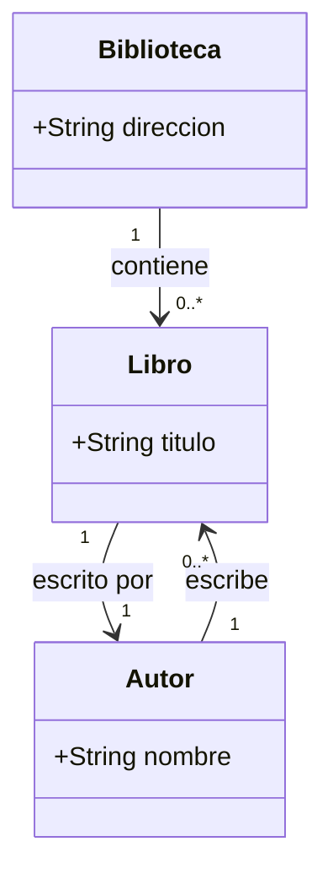
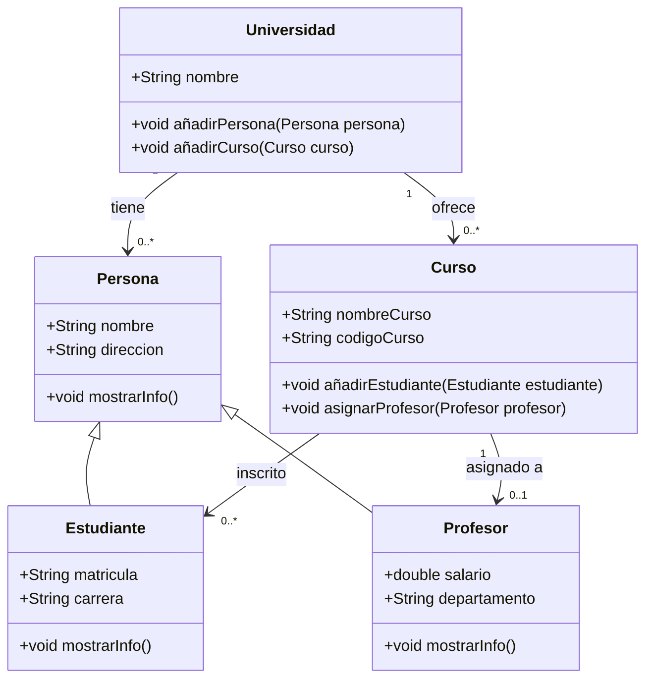

## Ejercicios Guiados Diagramas de Clases

### Teoría

Un `diagrama de clases` es una representación visual de las clases, interfaces, asociaciones y relaciones entre objetos en un sistema de software. Es una herramienta fundamental en la ingeniería de software para modelar la estructura estática de un sistema y capturar las relaciones entre las entidades del sistema.	

**Componentes de un Diagrama de Clases**

1. `Clases`: Representan las entidades del sistema y contienen atributos y métodos.
2. `Atributos`: Propiedades de una clase que describen el estado de un objeto.
3. `Métodos`: Comportamientos de una clase que definen las operaciones que un objeto puede realizar.
4. `Relaciones`: Diversos tipos de relaciones entre clases, como asociación, agregación, composición y dependencia.
5. `Asociaciones`: Relaciones entre clases que indican cómo se relacionan los objetos.
6. `Herencia`: Relación entre una clase base (superclase) y una clase derivada (subclase) que indica que la subclase hereda atributos y métodos de la superclase.
7. `Interfaz`: Una colección de métodos abstractos que define un comportamiento común para las clases que la implementan.


## Ejercicio Resuelto 1

Modela un diagrama de clases para una biblioteca. Cada biblioteca tiene una dirección y una colección de libros. Cada libro tiene un título y un autor. Un autor puede haber escrito varios libros, y cada libro es escrito por un solo autor.

**Clases:**

1. Clases:

   - Biblioteca
   - Libro
   - Autor

2. Atributos:

   - Biblioteca: direccion
   - Libro: titulo
   - Autor: nombre
  
3. Relaciones:

   - Una biblioteca tiene una colección de libros (1 biblioteca a muchos libros).
   - Un libro tiene un autor (muchos libros a 1 autor).
   - Un autor puede haber escrito varios libros (1 autor a muchos libros).


### **Diagrama de Clases:**



### **Código Java:**

```java
import java.util.List;

public class Biblioteca {
    private String direccion;
    private List<Libro> libros;

    public Biblioteca(String direccion, List<Libro> libros) {
        this.direccion = direccion;
        this.libros = libros;
    }

    public String getDireccion() {
        return direccion;
    }

    public void setDireccion(String direccion) {
        this.direccion = direccion;
    }

    public List<Libro> getLibros() {
        return libros;
    }

    public void setLibros(List<Libro> libros) {
        this.libros = libros;
    }

    public void addLibro(Libro libro) {
        this.libros.add(libro);
    }
}

public class Libro {
    private String titulo;
    private Autor autor;

    public Libro(String titulo, Autor autor) {
        this.titulo = titulo;
        this.autor = autor;
    }

    public String getTitulo() {
        return titulo;
    }

    public void setTitulo(String titulo) {
        this.titulo = titulo;
    }

    public Autor getAutor() {
        return autor;
    }

    public void setAutor(Autor autor) {
        this.autor = autor;
    }
}

import java.util.List;
import java.util.ArrayList;

public class Autor {
    private String nombre;
    private List<Libro> libros;

    public Autor(String nombre) {
        this.nombre = nombre;
        this.libros = new ArrayList<>();
    }

    public String getNombre() {
        return nombre;
    }

    public void setNombre(String nombre) {
        this.nombre = nombre;
    }

    public List<Libro> getLibros() {
        return libros;
    }

    public void addLibro(Libro libro) {
        this.libros.add(libro);
    }
}
```
Ejemplo de uso, de esa estructura de clases:

```java
import java.util.ArrayList;
import java.util.List;

public class Main {
    public static void main(String[] args) {
        // Crear autor
        Autor autor1 = new Autor("Gabriel Garcia Marquez");

        // Crear libros
        Libro libro1 = new Libro("Cien Años de Soledad", autor1);
        Libro libro2 = new Libro("El amor en los tiempos del cólera", autor1);

        // Añadir libros al autor
        autor1.addLibro(libro1);
        autor1.addLibro(libro2);

        // Crear lista de libros para la biblioteca
        List<Libro> libros = new ArrayList<>();
        libros.add(libro1);
        libros.add(libro2);

        // Crear biblioteca
        Biblioteca biblioteca = new Biblioteca("Calle Falsa 123", libros);

        // Mostrar información de la biblioteca
        System.out.println("Biblioteca en " + biblioteca.getDireccion());
        System.out.println("Libros disponibles:");

        for (Libro libro : biblioteca.getLibros()) {
            System.out.println("- " + libro.getTitulo() + " por " + libro.getAutor().getNombre());
        }
    }
}
```


## Ejercicio Resuelto 2

Modela un diagrama de clases para un sistema de gestión de una universidad. Debe incluir las clases Persona, Estudiante, Profesor, Curso y Universidad. Persona es una clase base que tiene atributos comunes a estudiantes y profesores. Estudiante y Profesor heredan de Persona. La Universidad tiene una lista de personas (estudiantes y profesores) y una lista de cursos. Cada curso puede tener varios estudiantes y un profesor asignado. Implementa métodos para añadir estudiantes a cursos y asignar profesores a cursos.

**Clases:**

- Persona: clase base con atributos comunes a todas las personas (nombre, dirección).
- Estudiante: hereda de Persona, con atributos adicionales (matrícula, carrera).
- Profesor: hereda de Persona, con atributos adicionales (salario, departamento).
- Curso: con atributos (nombre del curso, código del curso) y métodos (añadir estudiante, asignar profesor).
- Universidad: con atributos (nombre, lista de personas) y métodos (añadir persona, añadir curso).


### **Diagrama de Clases:**



### **Código Java:**

```java
public class Persona {
    private String nombre;
    private String direccion;

    public Persona(String nombre, String direccion) {
        this.nombre = nombre;
        this.direccion = direccion;
    }

    public String getNombre() {
        return nombre;
    }

    public void setNombre(String nombre) {
        this.nombre = nombre;
    }

    public String getDireccion() {
        return direccion;
    }

    public void setDireccion(String direccion) {
        this.direccion = direccion;
    }

    public void mostrarInfo() {
        System.out.println("Nombre: " + nombre + ", Dirección: " + direccion);
    }
}


public class Estudiante extends Persona {
    private String matricula;
    private String carrera;

    public Estudiante(String nombre, String direccion, String matricula, String carrera) {
        super(nombre, direccion);
        this.matricula = matricula;
        this.carrera = carrera;
    }

    public String getMatricula() {
        return matricula;
    }

    public void setMatricula(String matricula) {
        this.matricula = matricula;
    }

    public String getCarrera() {
        return carrera;
    }

    public void setCarrera(String carrera) {
        this.carrera = carrera;
    }

    @Override
    public void mostrarInfo() {
        super.mostrarInfo();
        System.out.println("Matrícula: " + matricula + ", Carrera: " + carrera);
    }
}

public class Profesor extends Persona {
    private double salario;
    private String departamento;

    public Profesor(String nombre, String direccion, double salario, String departamento) {
        super(nombre, direccion);
        this.salario = salario;
        this.departamento = departamento;
    }

    public double getSalario() {
        return salario;
    }

    public void setSalario(double salario) {
        this.salario = salario;
    }

    public String getDepartamento() {
        return departamento;
    }

    public void setDepartamento(String departamento) {
        this.departamento = departamento;
    }

    @Override
    public void mostrarInfo() {
        super.mostrarInfo();
        System.out.println("Salario: " + salario + ", Departamento: " + departamento);
    }
}


import java.util.ArrayList;
import java.util.List;

public class Curso {
    private String nombreCurso;
    private String codigoCurso;
    private Profesor profesor;
    private List<Estudiante> estudiantes;

    public Curso(String nombreCurso, String codigoCurso) {
        this.nombreCurso = nombreCurso;
        this.codigoCurso = codigoCurso;
        this.estudiantes = new ArrayList<>();
    }

    public String getNombreCurso() {
        return nombreCurso;
    }

    public void setNombreCurso(String nombreCurso) {
        this.nombreCurso = nombreCurso;
    }

    public String getCodigoCurso() {
        return codigoCurso;
    }

    public void setCodigoCurso(String codigoCurso) {
        this.codigoCurso = codigoCurso;
    }

    public Profesor getProfesor() {
        return profesor;
    }

    public void asignarProfesor(Profesor profesor) {
        this.profesor = profesor;
    }

    public List<Estudiante> getEstudiantes() {
        return estudiantes;
    }

    public void añadirEstudiante(Estudiante estudiante) {
        this.estudiantes.add(estudiante);
    }
}


import java.util.ArrayList;
import java.util.List;

public class Universidad {
    private String nombre;
    private List<Persona> personas;
    private List<Curso> cursos;

    public Universidad(String nombre) {
        this.nombre = nombre;
        this.personas = new ArrayList<>();
        this.cursos = new ArrayList<>();
    }

    public String getNombre() {
        return nombre;
    }

    public void setNombre(String nombre) {
        this.nombre = nombre;
    }

    public List<Persona> getPersonas() {
        return personas;
    }

    public void añadirPersona(Persona persona) {
        this.personas.add(persona);
    }

    public List<Curso> getCursos() {
        return cursos;
    }

    public void añadirCurso(Curso curso) {
        this.cursos.add(curso);
    }
}
```

Ejemplo de uso, de esa estructura de clases:

```java
public class Main {
    public static void main(String[] args) {
        // Crear universidad
        Universidad universidad = new Universidad("Universidad Nacional");

        // Crear profesor
        Profesor profesor1 = new Profesor("Juan Perez", "Calle 1", 50000, "Matemáticas");
        universidad.añadirPersona(profesor1);

        // Crear estudiantes
        Estudiante estudiante1 = new Estudiante("Maria Lopez", "Calle 2", "12345", "Ingeniería");
        Estudiante estudiante2 = new Estudiante("Carlos Gomez", "Calle 3", "67890", "Física");
        universidad.añadirPersona(estudiante1);
        universidad.añadirPersona(estudiante2);

        // Crear curso
        Curso curso1 = new Curso("Álgebra", "MAT101");
        universidad.añadirCurso(curso1);

        // Asignar profesor al curso
        curso1.asignarProfesor(profesor1);

        // Añadir estudiantes al curso
        curso1.añadirEstudiante(estudiante1);
        curso1.añadirEstudiante(estudiante2);

        // Mostrar información del curso
        System.out.println("Curso: " + curso1.getNombreCurso() + " (" + curso1.getCodigoCurso() + ")");
        System.out.println("Profesor: " + curso1.getProfesor().getNombre());
        System.out.println("Estudiantes inscritos:");

        for (Estudiante estudiante : curso1.getEstudiantes()) {
            estudiante.mostrarInfo();
        }
    }
}
```	


